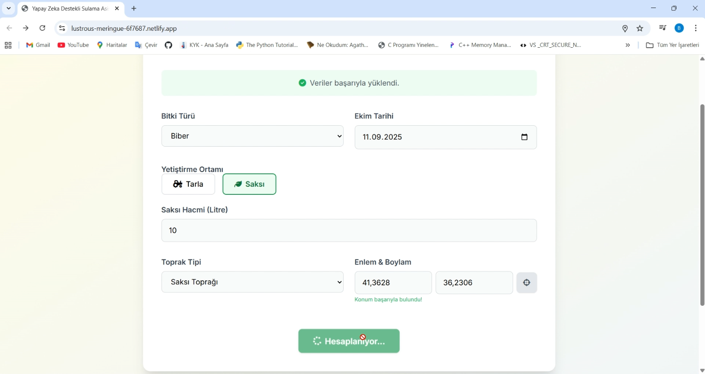

# 🌿 Sensorless Smart Irrigation Assistant

## Background & Achievement  
This project was developed during the **Samsung Innovation Campus Türkiye – Coding and Programming** course.  
It was presented at the final **Hackathon**, where it proudly won **1st Place** among the competing projects. 🎉 

The program is designed to equip participants with **fundamental coding and problem-solving skills**, and this project applied those skills to tackle one of today’s most pressing challenges: **sustainable water management in agriculture**.  
👉 [Learn more about the program](https://www.samsung.com/tr/innovation-campus/)

---

## Project Overview  
**Sensorless Smart Irrigation Assistant** is a Python- and web-based application that provides an **optimal irrigation schedule without requiring physical sensors**.  

Instead of costly and maintenance-heavy hardware, the system uses:  
- 🌱 Plant type and growth stages  
- 🌍 Soil type and cultivation environment (field or pot)  
- 📅 Planting date  
- ☀️ Weather forecasts (ET₀ evapotranspiration & rainfall)  

The software calculates a **7-day irrigation program** that helps farmers, gardeners, and hobbyists water their plants effectively while saving water and costs.

---

## Features  
- Sensorless irrigation recommendations  
- 7-day forecast-based watering schedule  
- Soil water balance model  
- Field and pot cultivation support  
- User-friendly web interface (HTML + Tailwind CSS + JavaScript)  
- Python CLI version for quick use in terminal  
- Low-cost and scalable solution (no sensors required)  

---
## Benefits

- Water saving — prevents unnecessary irrigation
- Sustainability — promotes responsible water use in agriculture
- Accessibility — easy to use for both farmers and hobby gardeners
- Cost-effective — no need for sensor hardware or maintenance
- Supports **UN Sustainable Development Goals**:
    * **Goal 2:** Zero Hunger
    * **Goal 6:** Clean Water and Sanitation
    * **Goal 12:** Responsible Consumption and Production
    * **Goal 13:** Climate Action
    * 
---

## Contributors

- **Berna Çakır**  
- **Burhan Kılıçkaya**
- **Fatih Yıldırım**

## Screenshots

  
  

🎥 **Demo Video:** [Watch on YouTube](https://youtu.be/OCGlecQtKtQ)

